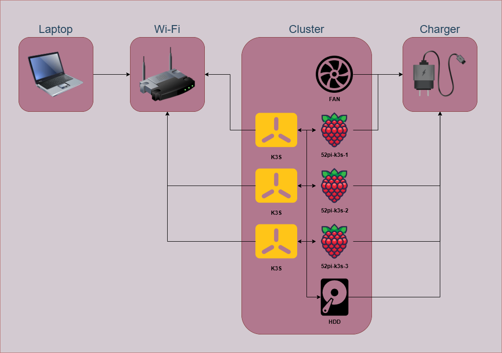

## Overview

This repository offers a collection of resources for building and deploying applications on a distributed computing cluster.

## Hardware

### Main configuration

- [Raspberry Pi 5](https://www.raspberrypi.com/products/raspberry-pi-5)
- [Waveshare 2.13" E-Ink Display HAT](https://www.waveshare.com/2.13inch-e-paper-hat.htm)
- [SanDisk Ultra UHS-I microSD](https://shop.sandisk.com/products/memory-cards/microsd-cards/sandisk-ultra-uhs-i-microsd-120-mbps)
- [Toshiba Canvio Basics HDD](https://storage.toshiba.com/consumer-hdd/external/canvio-basics)
- [52pi Rack Tower Ultimate](https://wiki.52pi.com/index.php?title=ZP-0108)

### Nice to have

- USB Charging Station
- USB Type-C to Type-A Cable
- USB Male to 5-Pin Dupont Cable
- USB Female to Dual Male Y-Cable
- Magnetic Cable Clips
- Silicone HDD Case

## Software

### Choco

- `choco install kubernetes-cli`
- `choco install kubernetes-helm`
- `choco install terraform`

### Helm

- `helm repo add kubernetes-dashboard https://kubernetes.github.io/dashboard`
- `helm repo add longhorn https://charts.longhorn.io`
- `helm repo update`

### Terraform

> [!NOTE]  
> The `local-exec` provisioner commands are intended to run on Windows.

- `terraform fmt -recursive`
- `terraform -chdir=terraform init`
- `terraform -chdir=terraform plan`
- `terraform -chdir=terraform apply`
- `terraform -chdir=terraform destroy`

### SSH

- `ssh-keygen -t rsa -f .ssh/52pi-k3s-1`
- `ssh -i .ssh/52pi-k3s-1 52pi-k3s-1@52pi-k3s-1`

### Type

- `type .server\address`
- `type .server\config`
- `type .server\node-token`

### Dashboard

- `cd scripts`
- `powershell -ExecutionPolicy Bypass -File .\dashboard.ps1`

### Longhorn

- `cd scripts`
- `powershell -ExecutionPolicy Bypass -File .\longhorn.ps1`
